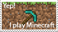

 
<h3>
  Áquila Morais
  
</h3>

📫 atemoraiscosta88@gmail.com 

_Graduando de Sistemas de informação e apreciador da tecnologia._

 

  
Sobre | More about me

  - 💬 Eu tenho 21 anos e estou graduando no curso de Sistemas de Informação na UNIFESSPA *[6/8]*.

  - ⚡ Gosto de ler, desenhar e jogar. Possuo vários objetivos no mundo da programação e estou animado para concluir cada uma delas, uma longa jornada ainda. 

---

### **Works** 

🦎 **Exception Jr** (Jul 2024 - Present): Empresa Junior UNIFESSPA, atuo como Desenvolvedor BackEnd e Designer 

---

### **Skills** 

---

### **Learning** 

 

**Others**

 

  
  
  
  

